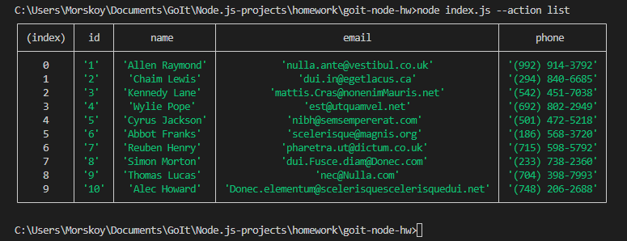
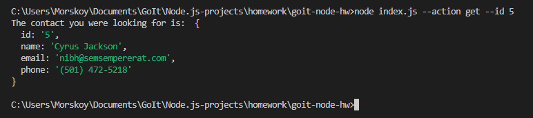
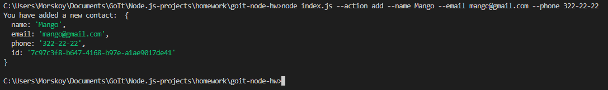
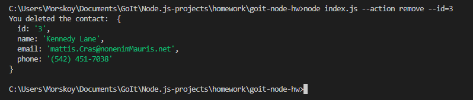

# goit-node-hw

## Скриншоты результатов выполнения каждой команды

- [Cписок контактов в виде таблицы](https://ibb.co/SrHtjYy)
- [Получили контакт по id](https://ibb.co/sVzB44f)
- [Добавили контакт](https://ibb.co/j49RVjB)
- [Удалили контакт](https://ibb.co/WgN69TM)

## Шаг 1
- Инициализируй npm в проекте
- В корне проекта создай файл index.js
- Поставь пакет nodemon как зависимость разработки (devDependencies)
- В файле package.json добавь "скрипты" для запуска index.js
- Скрипт start который запускает index.js с помощью node
- Скрипт start:dev который запускает index.js с помощью nodemon

## Шаг 2

В корне проекта создай папку db. Для хранения контактов скачай и используй файл contacts.json, положив его в папку db.

В корне проекта создай файл contacts.js.

Сделай импорт модулей fs и path для работы с файловой системой
Создай переменную contactsPath и запиши в нее путь к файлу contacts.json. Для составления пути используй методы модуля path.
Добавь функции для работы с коллекцией контактов. В функциях используй модуль fs и его методы readFile() и writeFile()
Сделай экспорт созданных функций через module.exports

```
contacts.js
/*
 * Раскомментируй и запиши значение
 * const contactsPath = ;
 */

// TODO: задокументировать каждую функцию
function listContacts() {
  // ...твой код
}

function getContactById(contactId) {
  // ...твой код
}

function removeContact(contactId) {
  // ...твой код
}

function addContact(name, email, phone) {
  // ...твой код
}
```

## Шаг 3
Сделай импорт модуля contacts.js в файле index.js и проверь работоспособность функций для работы с контактами.

## Шаг 4
В файле index.js импортируется пакет yargs для удобного парса аргументов командной строки. Используй готовую функцию invokeAction() которая получает тип выполняемого действия и необходимые аргументы. Функция вызывает соответствующий метод из файла contacts.js передавая ему необходимые аргументы.

```
index.js
const argv = require("yargs").argv;

// TODO: рефакторить
function invokeAction({ action, id, name, email, phone }) {
  switch (action) {
    case "list":
      // ...
      break;

    case "get":
      // ... id
      break;

    case "add":
      // ... name email phone
      break;

    case "remove":
      // ... id
      break;

    default:
      console.warn("\x1B[31m Unknown action type!");
  }
}

invokeAction(argv);
```

Так же, вы можете использовать модуль commander для парсинга аргументов командной строки. Это более популярная альтернатива модуля yargs
```
const { Command } = require("commander");
const program = new Command();
program
  .option("-a, --action <type>", "choose action")
  .option("-i, --id <type>", "user id")
  .option("-n, --name <type>", "user name")
  .option("-e, --email <type>", "user email")
  .option("-p, --phone <type>", "user phone");

program.parse(process.argv);

const argv = program.opts();

// TODO: рефакторить
function invokeAction({ action, id, name, email, phone }) {
  switch (action) {
    case "list":
      // ...
      break;

    case "get":
      // ... id
      break;

    case "add":
      // ... name email phone
      break;

    case "remove":
      // ... id
      break;

    default:
      console.warn("\x1B[31m Unknown action type!");
  }
}

invokeAction(argv);
```

## Шаг 5
Запусти команды в терминале и сделай отдельный скриншот результата выполнения каждой команды.

```
# Получаем и выводим весь список контактов в виде таблицы (console.table)
node index.js --action list


# Получаем контакт по id
node index.js --action get --id 5

```
```
# Добавялем контакт
node index.js --action add --name Mango --email mango@gmail.com --phone 322-22-22
```


```
# Удаляем контакт
node index.js --action remove --id=3
```



## Шаг 6 - Сдача домашнего задания

Скриншоты выполнения команд, можно залить на любой бесплатный облачный сервис хранения картинок (Пример: monosnap, imgbb.com) и соответствующие ссылки необходимо добавить в файл README.md. Создайте этот файл в корне проекта.

# Критерии приема

- Создан репозиторий с домашним заданием — CLI приложение
- Код соответствует техническому заданию проекта
- При выполнении кода не возникает необработанных ошибок
- Название переменных, свойств и методов начинается со строчной буквы и записываются в нотации CamelCase. Используются английские существительные
- Название функции или метода содержит глагол
- В коде нет закомментированных участков кода
- Проект корректно работает в актуальной LTS-версии Node